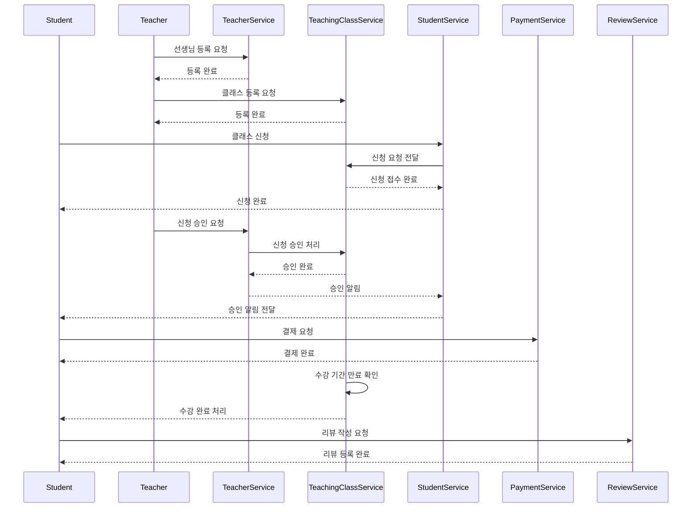

### 1. 시퀀스 정리



### 2. 초기 연관관계 구조 정리

```
Teacher <-1 : N-> TeachingClass
TeachingClass <-1 : N-> Review 
Student <-1 : N-> ClassRegistration
ClassRegistration <-1 : 1-> Payment
```

### 3. 유스케이스 책임 나누기

```
- TeacherService
  - 선생님을 등록할 수 있다.
  - 학생의 클래스 신청을 승인할 수 있다.
- TeachingClassService
  - 클래스를 등록할 수 있다.
  - 클래스 신청 승인 여부를 학생에게 알려줄 수 있다.
  - 클래스의 마감 여부를 확인해 클래스 상태(-> 수강 완료)를 변경할 수 있다.
- StudentService
  - 학생은 클래스를 신청할 수 있다.
- ReviewService
  - 클래스의 리뷰를 작성할 수 있다.
- PaymentService
  - 클래스 등록 정보를 통해 결제를 할 수 있다.
```